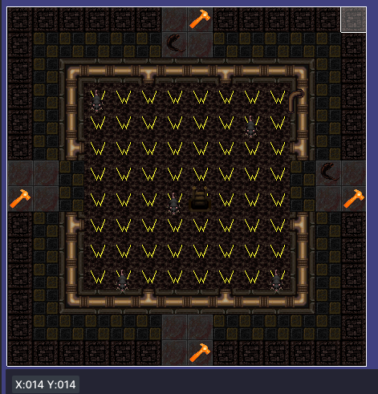
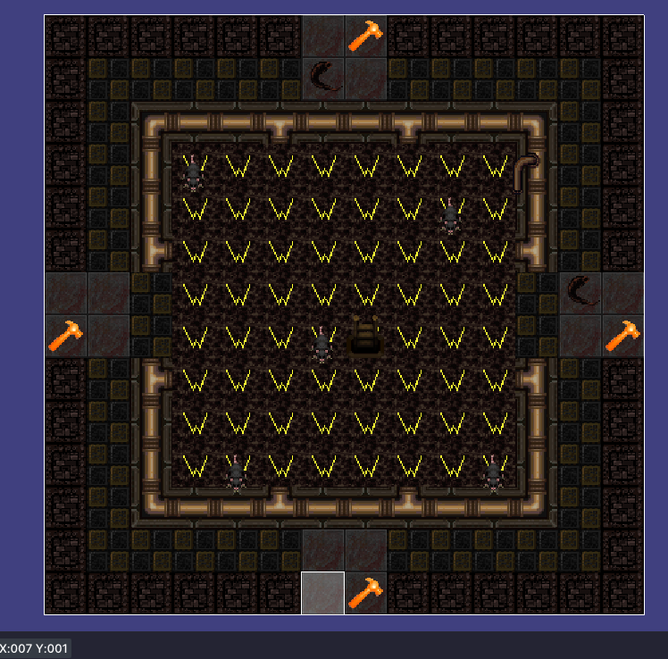

# How to Make Dungeon Maps
General Tips
- Make sure StrongDMM is set to save as TGM and not DMM
- Larger map sizes mean they are less likely to appear in rotation due to it having issues finding space
- When Loot Tables are in those are the preferred way to add loot to dungeons
- Avoid using Mammons as Loot

- You will find the actual templates at: 'code\datums\dungeon_generator\dungeon_templates' or if you are using VSCode search: /datum/map_template/dungeon

## Step 1: Choose the Type of Map
For most cases, the type of map will be **room**.
- You can check on the templates folder for a list of room types currently setup.
- The path would go like /datum/map_template/dungeon/**TYPE**/**NAME**
```dm
/datum/map_template/dungeon/room/sewer
```

---

## Step 2: Set the Map Path
Store the maps in properly labeled folders:

```dm
/datum/map_template/dungeon/room/Sewers2
    mappath = "_maps/map_files/matthios_tomb/room/Sewers2.dmm"
```

---

## Step 3: Assign an ID
Use the map name as the ID:
- Avoid using spaces in the name.

```dm
/datum/map_template/dungeon/room/Sewers2
    mappath = "_maps/map_files/matthios_tomb/room/Sewers2.dmm"
    id = "Sewers2"
```

---

## Step 4: Define the Dimensions
Set the **width** and **height** based on the topmost corner of the map.



```dm
/datum/map_template/dungeon/room/Sewers2
    mappath = "_maps/map_files/matthios_tomb/room/Sewers2.dmm"
    id = "Sewers2"
    width = 14
    height = 14
```

---

## Step 5: Configure Nodes
Nodes define where dungeon pieces will connect.
- Ensure they are placed at the **farthest** edge of the map.
- There should be **no tiles in front** of them.
- **USE THE DIRECTIONAL VARIANTS**
- **IGNORE THE TOP VARIANTS UNLESS YOU KNOW DAMN WELL WHAT YOU ARE DOING**


---

## Step 6: Assign Offsets
Offsets are determined by the tile **beside** the node (not on it).

- **North & South Offsets:**
  
  - Example: **7**

- **East & West Offsets:**
  
  - Example: **6**

```dm
/datum/map_template/dungeon/room/Sewers2
    mappath = "_maps/map_files/matthios_tomb/room/Sewers2.dmm"
    id = "Sewers2"
    width = 14
    height = 14

    north_offset = 7
    south_offset = 7
    east_offset = 6
    west_offset = 6
```

**If a direction does not exist, do not include it.**

Example of a map with only a **west offset**:

```dm
/datum/map_template/dungeon/room/graveend
    mappath = "_maps/map_files/matthios_tomb/room/graveend.dmm"
    id = "graveend"
    width = 24
    height = 7
    rarity = 20

    west_offset = 3
```

---

## Step 7: Adjust Rarity (Optional)
The **default rarity** is **100**. If set to **50**, it will appear **half as often**.

```dm
rarity = 50
```

---
